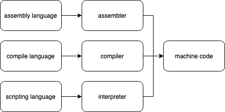

# Programming fundamentals

## What makes a computer?

Today, computers can do various things (from video editing, to balance sheets). It is so **flexible** because it is **programmable**.

If you breakdown anything a computer does, you will see the following:

Anything can be broken down to these building blocks:

- moving the mouse (INPUT), the computer will take the input from the mouse, calculate how much movement happened (PROCESS), and then update the location of the pointer on the screen (OUTPUT)
- increasing the volume from the onscreen toolbar icon (by dragging the slider) (INPUT), the computer will note the change, it will take the new level which was set (PROCESS), and change the output level of the sound card (OUTPUT)

## The components of a computer **hardware**

A computer is a very generic term. Typically people refer to the classic desktop PC as a computer, but laptops and smartphones (and other `smart` devices) are also computers. A computer is basically a system of components, which when connected together can perform whatever they are programmed to do. These components are the **hardware** of the system.

Lets look at the typical hardware that is required to make up a computer system.

What is the role of these components?

- on the left we see keyboard and mouse, they are typically **input** devices to the computer system
- on the right we see the display and speakers, typical **output** devices
- the CPU (Central Processing Unit) is the `brain` of the computer, it **processes** data
- the Motherboard, is typically a big printed circuit board, and allows everything the system needs, to be plugged directly into it.
- ROM memory (Read Only Memory), is where the Motherboard's firmware are stored (this is a small program that the CPU can execute) **STORAGE COMPONENT**
- RAM memory (Random Access Memory), is where data lives when the CPU needs to process it. Typically it has a smaller capacity compared to hard drives or solid state drives **STORAGE COMPONENT**
- Hard drives and solid state drives, is where data is stored, which can (when required) be loaded into the CPU to be processed. **STORAGE COMPONENT**
- Ports/interfaces, is components that allow computers to interface with various other devices outside of itself. We refer to interfaces as I/O devices (Input/Output devices). Typical interfaces are USB, VGA, HDMI, DisplayPort, Audio interfaces etc. **I/O COMPONENT**
- A fan, this is used to cool the computer's various components.
- PSU/powersupply, is used to provide power to the various components.

All these components are highly specialised, i.e. can do one thing very well. The one thing that makes computers so versatile is the **CPU**. It can be **programmed**.

**Ok, cool, but how do I program a computer???**
_We will have to understand a bit more about the CPU before we get to that_

## How does a CPU work?

Today's CPUs are all similar, in that they can process binary commands. These binary commands are also called **machine code**. How this machine code looks, depends on the CPU's _architecture_. You can view the _architecture_ as the CPU's heritage/family. Typical architectures are x86, x64 or ARM. They define what a CPU can do, i.e. they define what features a CPU has and what machine codes it can execute.

Have a look at [the x86 architecture's instruction listing wiki](https://en.wikipedia.org/wiki/X86_instruction_listings)

Typical machine code instructions, includes:

- Arithmetic: INC, DEC, ADD, SUB, MUL, DIV
- Logic: AND, OR, XOR, NOT
- Memory Calls/Variables, MOV, DW, DD
- Branch instruction like loops, if (conditional jump), method or function calling, GOTO
- System calls and many others

**So, in order for me to write an app I need to learn this `machine code`??**
_No, not at all... just read on_

We call this machine code **Assembler language** (the lowest level of programming languages, where the programmer has complete control of what the CPU will actually do). Some engineers use this when they need to program at that level. Programming in assembly is difficult, and you need to keep track of exactly what the CPU needs to do next, and the language is very low level. Think of lego blocks. It is possible to build a house with the smallest lego block, but it will require more blocks and make sure they don't swivel, easier to break.

To make programming easier, programmers created antother tool which allowed them to write programs in a different language, and then **compile** them to the machine code that can be executed by the CPU.

You probably have heard of MANY programming languages already. Some of the famous ones are C, C#, Java, Scala, Kotlin, Swift, Javascript etc.

Note that these are **programming languages**, not **computer languages**. (the only computer language which a CPU understands is machine code)

Different programming languages has different strenghts/weaknesses, tools, scalability, performance, syntax rules, cross-platform.

Have a look at the table below, and start learning a language (prefereably a high level language)

| Compiled Language                                                                                                                     | Interpreted Language                                                                     | Assembly Language                                   |
| ------------------------------------------------------------------------------------------------------------------------------------- | ---------------------------------------------------------------------------------------- | --------------------------------------------------- |
| Converts high-level language into machine code                                                                                        | Converts high-level language into machine code                                           | Converts mnemonic assembly language to machine code |
| converts the source code, file-by-file, eventually resulting in an executable (an `.exe` or a `.jar`)                                 | converts the source code, line-by-line to machine code, and executes it at the same time | Converts the language very quickly                  |
| the file can then be executed on any other machine (if it was compiled for that machine) without the compiler needing to be present   | the translator needs to be present where the program needs to run                        |                                                     |
| can take longer to compile, as the compiler will need to convert the code into various sets of code (for different CPU architectures) | easier to develop/test with, because lengthy compile step is never needed                |
| only needs to compile the code once                                                                                                   | needs to be translated everytime the code needs to run                                   |

## References:

[How Computers Work](https://www.youtube.com/watch?v=OAx_6-wdslM&list=PLzdnOPI1iJNcsRwJhvksEo1tJqjIqWbN-)

how to prepare to learn programming

https://www.codingdojo.com/blog/7-tips-learn-programming-faster lead to
Programming 101 - 5 Basic Concepts of Programming

[Computer Architecture - Interpreter, Compiler & Assembler](https://www.youtube.com/watch?v=uKotrtLzJbw)

## Help resources

https://stackoverflow.com/

https://www.reddit.com/r/learnprogramming/
